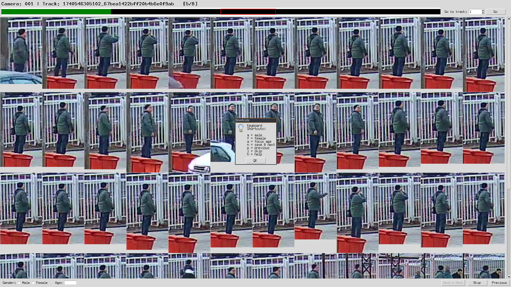

# How to run
run the script.

    python tool.py
specify directory with your stream (camera) folders that looks like

    000 001 002

your labeled results would be saved in *labels.csv* file
# Shorcuts
press `h` to see shortcuts

